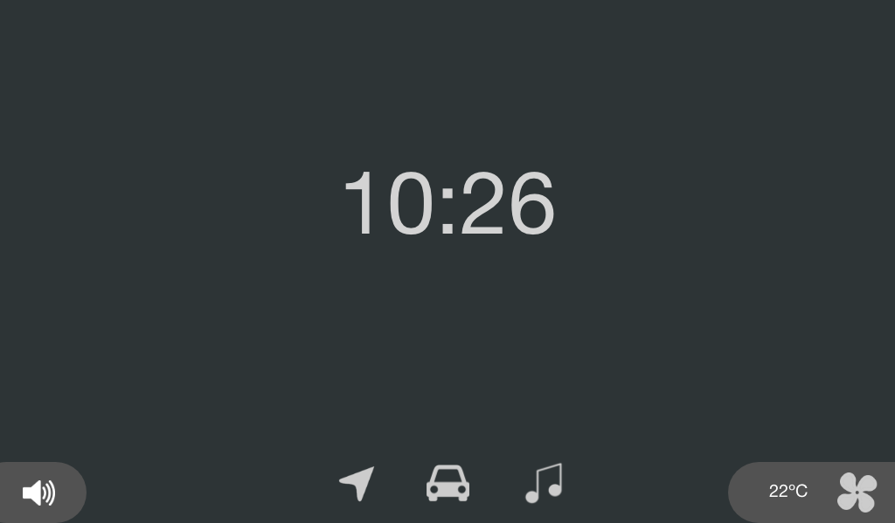

# Relectric Car Team User Interface

This repository contains the code for the user interface (UI) including the dashboard and the infotainment system.
This program is to be run on a Raspberry Pi and 2 displays simultaneously on a headless browser that will interact with each other.

### About the Project


This is a draft of the infotainment system, containing functionality for navigation, car stats, music, climate, and more.

### Built With
- [Ionic React](https://ionicframework.com)

## Getting Started

### Prerequisites

- nodejs
```bash
apt install nodejs
```
- [yarn](https://classic.yarnpkg.com/en/docs/install)
- ionic
```bash
yarn add ionic
```

### Installation

1. Clone this repository

```bash
git clone https://github.com/relectric-car-team/user-interface.git
```

2. Start the program once all prerequisites are fulfilled.
```bash
ionic serve
```

## License
This repository is distributed under the MIT License.
