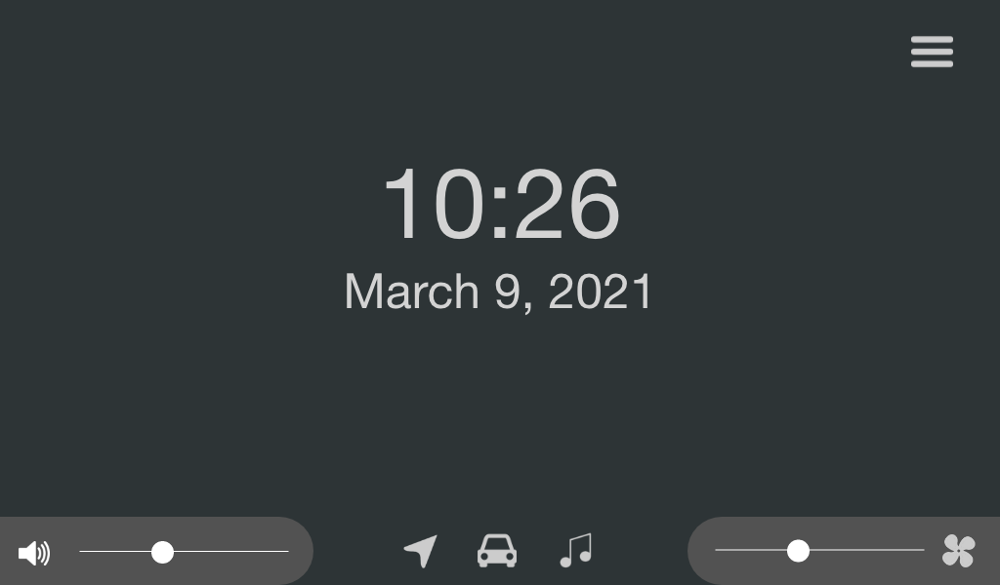

    

# Relectric Car Team User Interface

This repository contains the code for the user interface (UI) including the dashboard and the infotainment system.
This program is to be run on a Raspberry Pi and 2 displays simultaneously that will interact with each other.

[](https://app.netlify.com/sites/relectric-ui/deploys)

Link to live demo: [relectric-ui.netlify.app](https://relectric-ui.netlify.app)

### About the Project



This is a mockup of the infotainment system, containing functionality for navigation, car stats, music, climate, and more.

### Built With

-   [Ionic React](https://ionicframework.com)

## Getting Started

### Using Docker (recommended)

#### Prerequisites

Ensure that you have Docker and `docker-compose` installed on your development computer: [Docker website](https://www.docker.com). Windows computers will need to use WSL2 (Windows Subsystem for Linux) as a backend following [this guide](https://docs.docker.com/docker-for-windows/wsl/).

#### Installation and Development

```bash
# Clone this repo
git clone https://github.com/relectric-car-team/user-interface.git
cd user-interface

# Start development server
docker-compose up
```

To quit the development environment, simply press Ctrl+C and the Docker container will shut down.

### Manual method (not recommended)

#### Prerequisites

Ensure that you have the standard Node.js development tools available to use and the Yarn Package Manager installed globally.

-   [Node.js](https://nodejs.org/en/)
-   [Yarn](https://yarnpkg.com)
-   [Ionic CLI](https://ionicframework.com/docs/cli)

#### Installation and Development

```bash
# Clone this repo
git clone https://github.com/relectric-car-team/user-interface.git
cd user-interface

# Install dependencies
yarn install

# Start development server
ionic serve
```

## Contributing

Pull requests are welcome. Please use semantic commit messages and branch naming conventions using [this guide](https://www.conventionalcommits.org/en/v1.0.0/). Private branches should be named using the `semantic/name/purpose` convention. For example: `docs/ratik/update-readme` signifies that Ratik is responsible for this documentation change and the purpose of the branch is to update the README. For major changes, please open an issue first to discuss what you would like to change. Please base all pull requests off of the main branch as they will be rebase merged. Before opening a pull request: check that there are no linter issues by running `yarn run lint-check`, fix all formatting using `yarn run prettier-fix`, and ensure that your private branch is based off main as only rebase merging will be used. The linear history requirement is enforced on main.

Please make sure to update and add tests as appropriate.

## License

This repository is distributed under the MIT License.
